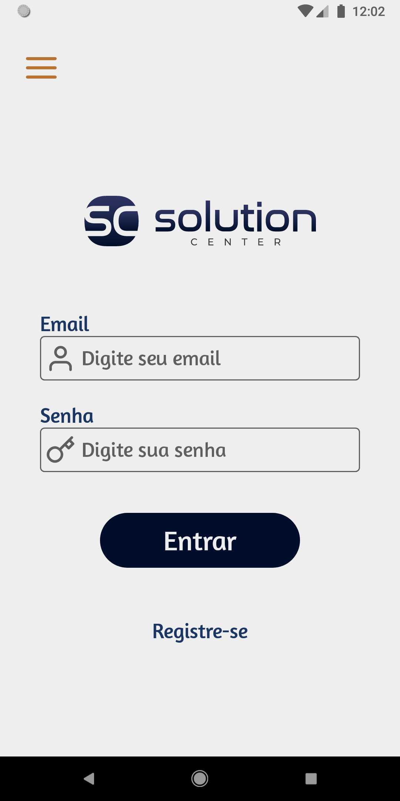
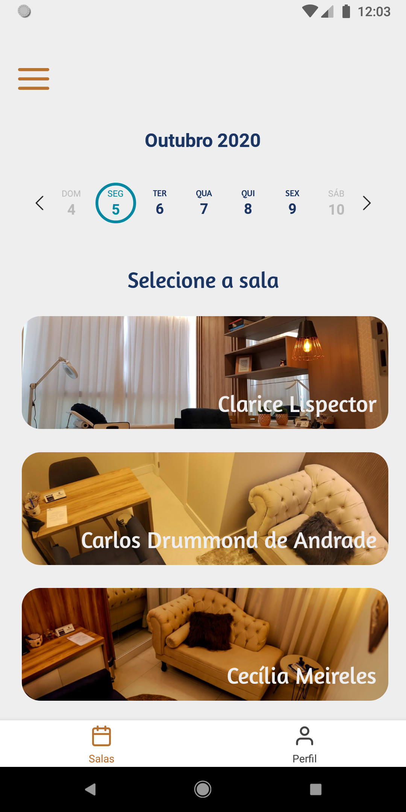
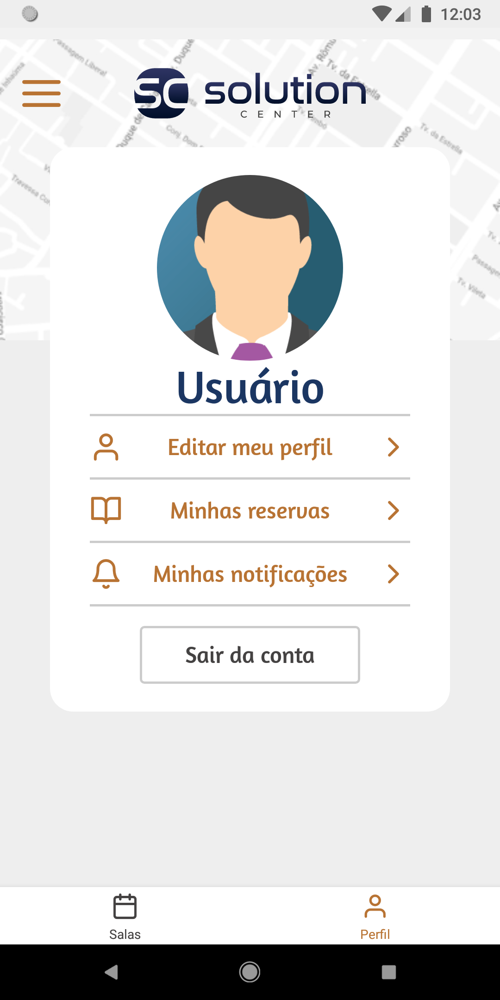

# Solution Center

## Objetivo do programa.

Esse aplicativo nasceu da deficiência  da empresa em controlar as reservas do usuário, que anteriormente era feito via WhatsApp.

## Como funciona?

O app consiste em agendamento das salas pelo cliente de acordo com sua necessidade. cada ambiente conta com recursos específicos afim de abranger uma vasta quantidade de profissionais.

## Imagens

## Como rodar localmente?

Em breve será disponibilizado o _.apk_ para testes.